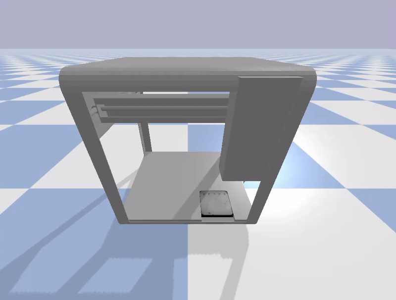

# OT-2 Robotic Simulation Environment

## Overview
This project involves simulating the Opentrons OT-2 robotic system using PyBullet. The task includes:

- Setting up the simulation environment.
- Sending commands to the robot and observing its state.
- Determining the working envelope for the pipette tip by moving it to each corner of the workspace.

---

## Dependencies
To successfully run the simulation, the following dependencies are required:

### Python Dependencies
- Python 3.9 or above
- PyBullet: The physics engine used for the simulation.
- NumPy: For numerical operations.
- Matplotlib: Optional, for visualization.
- ffmpeg: For GIF creation (if generating simulation output as a GIF).
### Installation
1. Install Python 3.9 or above from Python.org.
2. Use the following command to install the dependencies:

pip install pybullet numpy matplotlib

---

## Environment Setup
1. Clone the OT-2 Digital Twin Repository: Clone the GitHub repository containing the OT-2 simulation environment:

git clone https://github.com/BredaUniversityADSAI/Y2B-2023-OT2_Twin.git
Navigate to the project directory:

cd Y2B-2023-OT2_Twin
2. Install Dependencies: As described above, install the Python dependencies in your Python environment.

3. Verify Simulation Files: Ensure the following files and folders are present:

- sim_class.py: Contains the Simulation class.
- custom.urdf: The URDF file representing the OT-2 robot.
- Other support files such as textures/, meshes/, etc.
4. Run the Simulation: Write or modify the Python script (e.g., simulation_code.py) to:

- Initialize the simulation.
- Move the pipette to all 8 corners of the workspace.
- Record the pipette's coordinates at each corner.

---

## Working Envelope
The working envelope of the OT-2 pipette tip was determined by moving it to the 8 corners of a cuboidal workspace. The following coordinates represent the workspace limits:

| Corner | X    | Y    | Z    |
|--------|------|------|------|
| 1      | -0.18 | -0.18 | 0.25 |
| 2      | -0.18 | 0.18  | 0.25 |
| 3      | -0.18 | 0.18  | -0.25 |
| 4      | -0.18 | -0.18 | -0.25 |
| 5      | 0.18  | -0.18 | 0.25 |
| 6      | 0.18  | -0.18 | -0.25 |
| 7      | 0.18  | 0.18  | 0.25 |
| 8      | 0.18  | 0.18  | -0.25 |

### Simulation GIF

The following GIF shows the simulation in action:

---

## Code Explanation
### Script: simulation_code.py
This script runs the OT-2 simulation and calculates the working envelope.

1. Initialize the Simulation:

from sim_class import Simulation
sim = Simulation(num_agents=1)
2. Move to Each Corner:

- Define the velocities for each axis to move the pipette to each corner.
- Log the pipette's position after each move.
3. Example Code Snippet:

corners = []
for velocity_x, velocity_y, velocity_z in [
    (0.5, 0.5, 0.5), (-0.5, -0.5, -0.5),  # Add remaining 6 corners
]:
    actions = [[velocity_x, velocity_y, velocity_z, 0]]
    state = sim.run(actions, num_steps=200)
    position = state['robotId_1']['joint_states']['joint_0']['position']
    corners.append(position)
print("Working Envelope Corners:", corners)
4. Output:

- Prints the coordinates of each corner to the terminal.
- Optionally, generates a GIF showing the pipette moving to all corners.