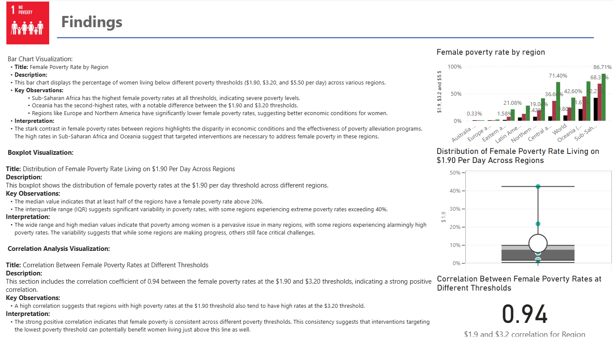

# 🌍 SDG 1 – Female Poverty Dashboard

**Author:** Mohamed Elshami  
**Programme:** BSc Applied Data Science & Artificial Intelligence – Breda University of Applied Sciences (BUas)  
**Date:** October 2023 
**Tools:** Power BI | Python (Pandas, NumPy) | CRISP-DM Framework  

---

## 📘 Overview

This project visualizes **female poverty rates across world regions** in support of **Sustainable Development Goal (SDG) 1 – No Poverty**.  
The interactive Power BI dashboard explores regional disparities, highlights global trends, and provides insights to guide data-driven policy decisions.

The analysis follows the **CRISP-DM** process, from **Business Understanding** to **Data Understanding**, **Exploration**, and **Visualization**.

---

## 🧠 Research Questions
1. What are the variations in the female poverty rate across different regions?  
2. Which region has the highest poverty rate for women?

---

## 🧩 Methodology

### **1. Business & Data Understanding**
The dashboard focuses on SDG 1, emphasizing **female poverty** as a critical social issue.  
Data was obtained from open global sources including:
- **World Bank – Poverty and Inequality Platform (PIP)**
- **UN Women / UNDP**
- **Pardee Center – International Futures (IFs Model)**  

### **2. Data Preparation**
- Used first row as header for clarity  
- Renamed columns (e.g., *Female Poverty Rate*)  
- Converted `$1.90`, `$3.20`, `$5.50` thresholds to numeric % values  
- Removed duplicates and missing values  
- Scaled numeric data for consistent comparison  

### **3. Exploratory Data Analysis (EDA)**
Performed in Power BI (and optionally in Python) to assess data quality and trends:
- Summary statistics (mean, median, std. dev.)  
- Distribution analysis using boxplots and histograms  
- Correlation analysis across thresholds  

### **4. Visualization Design**
Dashboard pages:  
1. **Introduction** – Context and SDG goal  
2. **Female Poverty Rate** – Regional comparison bar charts  
3. **Findings** – Key insights and correlations  
4. **Conclusion & Next Steps** – Recommendations and future analysis  

All visuals maintain a **consistent SDG 1 color theme** and support interactivity through slicers and filters.

---

## 📊 Key Findings

| Observation | Insight |
|--------------|----------|
| **Highest poverty** | Sub-Saharan Africa has the highest female poverty rates across all thresholds. |
| **Second highest** | Oceania (excluding Australia/NZ) consistently ranks second. |
| **Lowest poverty** | Europe and Northern America show minimal rates, reflecting stronger social safety nets. |
| **Correlation** | A strong positive correlation (**r ≈ 0.94**) between $1.90 and $3.20 thresholds — indicating consistency in female poverty levels. |

---

## 💬 Discussion & Recommendations

- **Missing Data:** Some regions lack complete economic indicators, potentially biasing results.  
- **Collection Bias:** Underreporting possible in areas with limited data accessibility for women.  
- **Skewed Distribution:** Requires normalization to ensure robust comparisons.  

**Future Work**
- Apply regression and correlation models for deeper analysis.  
- Extend to time-series poverty trends.  
- Integrate socioeconomic covariates such as education and employment rates.

---

## ✅ Conclusion

The project demonstrates how **data-driven dashboards** can uncover gender-specific poverty disparities and support the UN’s SDG agenda.  
Key takeaways:
- Regional and economic conditions strongly shape female poverty.  
- Policy interventions must prioritize regions with extreme poverty (especially Sub-Saharan Africa).  
- Power BI provides an effective storytelling medium for communicating analytical findings.

For detailed methodology and visuals, see the full report:

📄 [`docs/report.pdf`](./docs/report.pdf)

---

## 🧰 Tech Stack
- **Power BI** – Data visualization & dashboard design  
- **Python** – Exploratory data analysis (optional)  
- **CRISP-DM Framework** – Structured analytical process  

---

## 👤 Author
**Mohamed Elshami**  
3rd-Year Student – Applied Data Science & Artificial Intelligence  
Breda University of Applied Sciences (BUas)  

📧 melshami909@gmail.com  
🔗 [LinkedIn](https://www.linkedin.com/in/mohamed-elshami/) | [Portfolio](https://mohamedelshami233464.github.io/)

---

### © 2025 Mohamed Elshami. All Rights Reserved.
